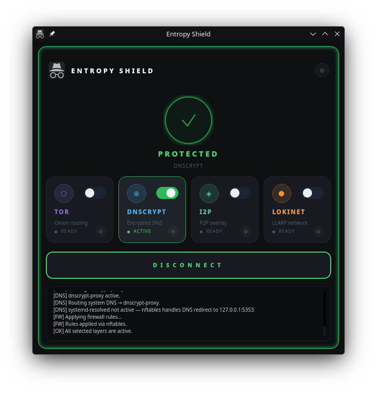
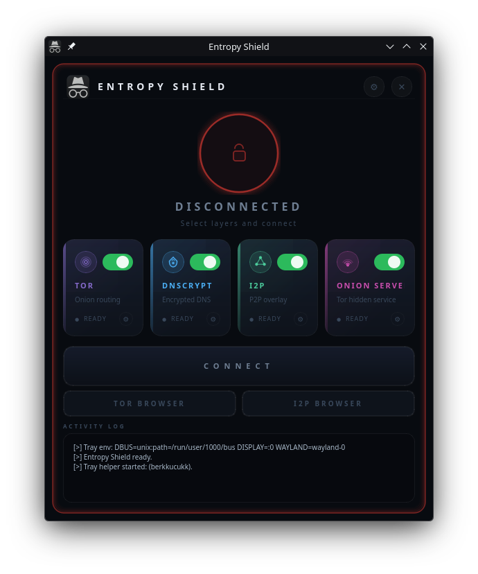

<div align="center">

### [🌐 entropy-shield.berkkucukk.com](https://entropy-shield.berkkucukk.com)

<br/>


# Entropy Shield

**A modern Linux desktop privacy stack — Tor · DNSCrypt · I2P · Lokinet**

[](https://entropy-shield.berkkucukk.com)
[](LICENSE)
[](https://python.org)
[](https://pypi.org/project/PyQt6/)
[](https://kernel.org)
[](https://nixos.org)

<br/>



*One-click control over your entire privacy layer stack.*

</div>

---

## Table of Contents

- [Overview](#overview)
- [Features](#features)
- [Privacy Layers](#privacy-layers)
- [Screenshots](#screenshots)
- [Requirements](#requirements)
- [Installation](#installation)
- [Usage](#usage)
- [Configuration](#configuration)
- [Architecture](#architecture)
- [Supported Distributions](#supported-distributions)
- [License](#license)

---

## Overview

Entropy Shield is a graphical frontend for managing multiple privacy and anonymity services on Linux. Instead of manually configuring `torrc`, writing nftables rules, and restarting daemons, Entropy Shield does it all through a single polished interface.

It routes your traffic through whichever combination of layers you choose — Tor transparent proxy, encrypted DNS via DNSCrypt, the I2P anonymity network, or Lokinet — then tears everything back down cleanly when you disconnect. System configs are backed up before modification and restored on exit.

> **Website:** [entropy-shield.berkkucukk.com](https://entropy-shield.berkkucukk.com)

---

## Features

| | Feature |
|---|---|
| 🔒 | **Layered privacy** — combine Tor, DNSCrypt, I2P, and Lokinet in any combination |
| 🔥 | **Firewall integration** — nftables/iptables rules applied and removed automatically |
| 🌙 | **Dark & Light themes** — polished animated UI with glowing status border |
| 🗂️ | **System tray** — minimize to tray, disconnect or quit from the notification area |
| ♻️ | **Zero footprint** — all config changes are backed up and reverted on disconnect |
| ⚙️ | **Per-service settings** — configure ports, exit nodes, DNSSEC, bandwidth limits, and more |
| 🐧 | **Multi-distro support** — one universal installer for Arch, Debian, Fedora, openSUSE, NixOS |
| ❄️ | **NixOS native** — declarative NixOS module, no mutable config patching |

---

## Privacy Layers

<table>
<tr>
<td align="center" width="25%">

### 🧅 Tor

Transparent proxy that routes **all TCP traffic** through the Tor network using nftables `REDIRECT` rules. DNS queries are redirected to Tor's `DNSPort`, preventing leaks. Supports custom exit nodes and `StrictNodes`.

</td>
<td align="center" width="25%">

### 🔐 DNSCrypt

Encrypts DNS queries using [dnscrypt-proxy](https://github.com/DNSCrypt/dnscrypt-proxy). Enforces no-log and no-filter server requirements. Stops `systemd-resolved` temporarily to avoid port conflicts, restores it on disconnect.

</td>
<td align="center" width="25%">

### 🌐 I2P

Starts [i2pd](https://i2pd.website) and configures its HTTP proxy (`127.0.0.1:4444`) and SOCKS proxy (`127.0.0.1:4447`). When used together with Tor, I2P traffic is tunnelled through Tor's SOCKS port for additional anonymity.

</td>
<td align="center" width="25%">

### 🦎 Lokinet

Routes traffic through [Lokinet](https://lokinet.org), an onion-routing network built on the Oxen blockchain. Configurable SOCKS port and optional exit node selection.

</td>
</tr>
</table>

---

## Screenshots

<div align="center">

| Protected | Disconnected |
|:---:|:---:|
|  |  |
| All layers active — animated green glow | Idle state — select layers and connect |

</div>

---

## Requirements

- **OS:** Linux (systemd-based)
- **Python:** 3.10 or later
- **PyQt6:** 6.4 or later
- **Privileges:** Root (via `pkexec` — polkit policy installed automatically)

**Privacy service dependencies** (installed automatically by the installer):

| Service | Package |
|---|---|
| Tor | `tor` |
| DNSCrypt | `dnscrypt-proxy` |
| I2P | `i2pd` |
| Firewall | `nftables` / `iptables` |

---

## Installation

### Universal Installer (Recommended)

The universal installer automatically detects your distribution and installs all dependencies.

```bash
git clone https://github.com/berkkucukk/entropy-shield.git
cd entropy-shield
bash installers/install.sh
```

The installer handles everything:

- Package installation per distro (pacman / apt / dnf / zypper / nix)
- PyQt6 via system package with pip fallback (PEP 668 compliant)
- Desktop entry, application icon, launcher wrapper at `/usr/local/bin/entropy-shield`
- Polkit policy so `pkexec` works without repeated password prompts
- SELinux context labels on Fedora / RHEL
- NixOS module generation + `nixos-rebuild switch`

> For an unrecognised distro, override detection: `DISTRO_ID=arch bash installers/install.sh`

---

### Distro-specific Installers

```bash
# Arch Linux / Manjaro / EndeavourOS
bash installers/install-arch.sh

# Debian / Ubuntu / Linux Mint / Kali / Pop!_OS
bash installers/install-debian.sh

# Fedora / RHEL / AlmaLinux / Rocky Linux
bash installers/install-fedora.sh

# NixOS
bash installers/install-nixos.sh
```

---

### NixOS

The NixOS installer writes a declarative module to `/etc/nixos/entropy-shield.nix` and patches `configuration.nix` to import it, then runs `nixos-rebuild switch`. Services are defined as on-demand systemd units with **no `wantedBy`** — they never auto-start at boot; Entropy Shield controls them entirely.

```nix
# Automatically added to /etc/nixos/configuration.nix:
imports = [ ./entropy-shield.nix ];
```

---

### Manual / Development

```bash
git clone https://github.com/berkkucukk/entropy-shield.git
cd entropy-shield
pip install PyQt6
sudo python3 main.py
```

---

## Usage

Launch from the application menu or run:

```bash
entropy-shield
```

The application requests elevated privileges via `pkexec` on first launch. After the polkit policy is installed, subsequent launches authenticate transparently without a password dialog.

**Workflow:**

1. Toggle the service cards you want to activate (Tor, DNSCrypt, I2P, Lokinet)
2. Click **CONNECT** — services start, firewall rules are applied, DNS is redirected
3. The status ring turns green and the border glows to confirm protection is active
4. Click **DISCONNECT** to stop all services and restore original system configuration

**System tray:** Closing the window minimises to the system tray. Right-click the tray icon to show the window, disconnect, or quit.

---

## Configuration

Settings are stored at `~/.config/entropy-shield/config.json` and can be edited through the in-app **Settings** panel (⚙ button in the top-right corner).

<details>
<summary>Default configuration</summary>

```json
{
  "theme": "dark",
  "tor": {
    "trans_port": 9040,
    "dns_port": 5300,
    "socks_port": 9050,
    "exit_nodes": "",
    "strict_nodes": false
  },
  "dnscrypt": {
    "port": 5300,
    "require_dnssec": false,
    "require_nolog": true,
    "require_nofilter": true
  },
  "i2p": {
    "http_port": 4444,
    "socks_port": 4447,
    "max_bandwidth": 0
  },
  "lokinet": {
    "socks_port": 1090,
    "exit_node": "",
    "use_exit": false
  }
}
```

</details>

### Tor Exit Nodes

Restrict exit traffic to specific countries by entering ISO codes in **Settings → Tor**:

```
Exit Nodes:   {us},{de},{nl}
Strict Nodes: ✓
```

### DNSCrypt Server Requirements

| Option | Description |
|---|---|
| Require no-log | Only use resolvers that do not log queries |
| Require no-filter | Exclude resolvers that apply content filtering |
| Require DNSSEC | Only use DNSSEC-validating resolvers |

---

## Architecture

```
entropy-shield/
├── main.py                  # Entry point — privilege escalation via pkexec
├── core/
│   ├── config.py            # JSON config with deep-merge defaults
│   ├── connection.py        # Orchestrates all layers (connect / disconnect)
│   ├── tor.py               # torrc patching, DNS redirect, systemd control
│   ├── dnscrypt.py          # dnscrypt-proxy config, resolved integration
│   ├── i2p.py               # i2pd config, Tor-tunnel mode
│   ├── lokinet.py           # Lokinet SOCKS proxy management
│   ├── firewall.py          # nftables / iptables transparent proxy rules
│   ├── tray_helper.py       # System tray subprocess (runs as real user)
│   └── platform.py          # NixOS detection
├── gui/
│   ├── main_window.py       # Main window, animated glow border, worker thread
│   ├── settings_panel.py    # Slide-in settings overlay
│   ├── themes.py            # Dark / Light theme palette + QSS generation
│   └── widgets.py           # ServiceCard, StatusRing, Spinner
├── logos/
│   └── entropy-logo.png
├── screenshots/
└── installers/
    ├── install.sh           # Universal distro-detecting installer
    ├── install-arch.sh
    ├── install-debian.sh
    ├── install-fedora.sh
    └── install-nixos.sh
```

### How it works

Entropy Shield runs as root (via `pkexec`) to manage system services and firewall rules. The system tray helper is launched as a subprocess under the original user's session to access the D-Bus session bus and register the SNI tray icon — this avoids the common problem where root processes cannot reach the user's display server or notification area.

**CONNECT flow:**

1. Selected service configs are patched (originals backed up with `.entropy-shield.bak` suffix)
2. Services are started via `systemctl restart`
3. `FirewallManager` applies nftables rules to redirect all TCP through the transparent proxy
4. DNS is redirected through the active service's local listener port

**DISCONNECT flow:**

1. Firewall rules are flushed
2. All started services are stopped
3. Config files are restored from backup
4. DNS and `systemd-resolved` are restored to their pre-connection state

---

## Supported Distributions

| Distribution | Package Manager | Notes |
|---|---|---|
| Arch Linux, Manjaro, EndeavourOS, Garuda | `pacman` | All packages in official repos |
| Debian, Ubuntu, Linux Mint, Kali, Pop!\_OS, Zorin | `apt` | i2pd may require a third-party repo |
| Fedora, RHEL, AlmaLinux, Rocky Linux | `dnf` | dnscrypt-proxy / i2pd via Copr if absent from main repo |
| openSUSE Leap / Tumbleweed | `zypper` | |
| NixOS | `nixos-rebuild` | Declarative module — no mutable config files |

---

## License

MIT © [Berk Küçük](https://berkkucukk.com)

---

<div align="center">

**[entropy-shield.berkkucukk.com](https://entropy-shield.berkkucukk.com)**

<sub>Built with Python · PyQt6 · Tor · DNSCrypt · I2P · Lokinet</sub>

</div>
