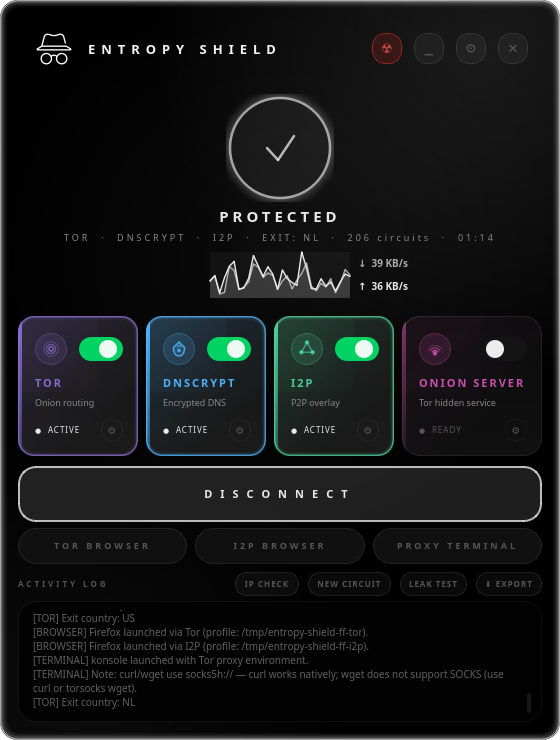
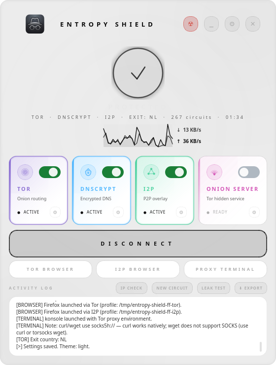
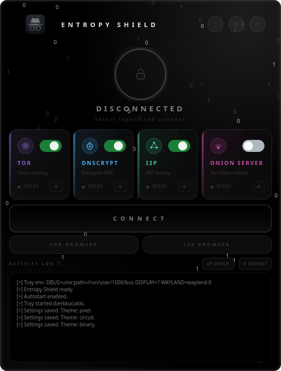
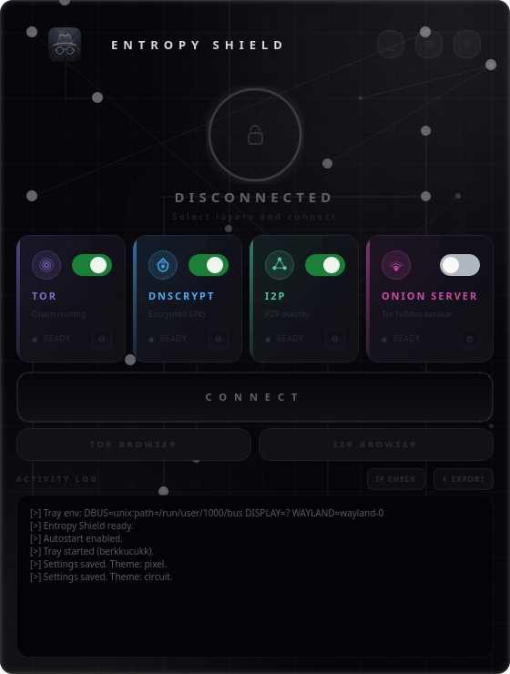
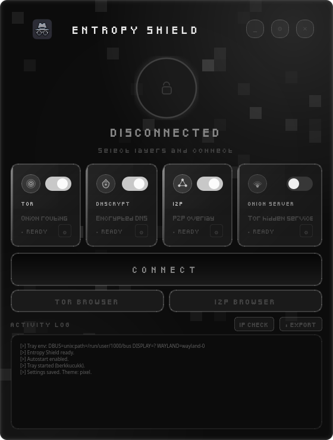

<div align="center">

<br/>


# Entropy Shield

### Linux Privacy Stack — Tor Transparent Proxy · DNSCrypt · I2P · Onion Server · GUI

[](https://entropy-shield.berkkucukk.com)
[](LICENSE)
[](https://python.org)
[](https://pypi.org/project/PyQt6/)
[](https://kernel.org)
[](https://nixos.org)

<br/>

**A graphical front-end to manage Tor, DNSCrypt-proxy, I2P (i2pd), and Tor hidden services on Linux — all in one place.**

*One-click control over your entire anonymity and privacy layer stack.*

</div>

---

## What is Entropy Shield?

**Entropy Shield** is an open-source Linux privacy tool that lets you combine and control multiple anonymity layers through a single GUI:

- **Tor transparent proxy** — route all TCP traffic through the Tor network
- **DNSCrypt / DNS encryption** — encrypt DNS queries, prevent DNS leaks
- **I2P (i2pd)** — access the I2P anonymous network with full transparent proxy support
- **Onion Server** — host a Tor hidden service (.onion address) from any local directory
- **Privacy-hardened Firefox** — isolated browser profiles for Tor and I2P browsing
- **Firewall (nftables/iptables)** — automatic firewall rules with IPv6 leak prevention
- **Kill switch** — auto-disconnect all layers if any privacy service drops

No more editing `torrc` by hand, writing nftables rules, or restarting systemd services manually. Entropy Shield handles everything and restores your original system config on disconnect.

> **Website:** [entropy-shield.berkkucukk.com](https://entropy-shield.berkkucukk.com)

---

## Table of Contents

- [Screenshots](#screenshots)
- [Features](#features)
- [Privacy Layers](#privacy-layers)
- [Themes](#themes)
- [Requirements](#requirements)
- [Installation](#installation)
- [Usage](#usage)
- [Configuration](#configuration)
- [Architecture](#architecture)
- [Supported Distributions](#supported-distributions)
- [License](#license)

---

## Screenshots

### OLED — Pure black, ambient glow

<div align="center">

</div>

<br/>

### Light — Clean white panels

<div align="center">

</div>

<br/>

### Binary — Hacker terminal with live binary rain

<div align="center">

</div>

<br/>

### Circuit — PCB trace background, dark grey

<div align="center">

</div>

<br/>

### Pixel — Retro pixel art, Minecraft-inspired monochrome

<div align="center">

</div>

<br/>

### System Tray

<div align="center">

</div>

---

## Features

| Feature | Description |
|---|---|
| **Layered anonymity** | Combine Tor, DNSCrypt, I2P, and Onion Server in any combination |
| **Automatic firewall** | nftables/iptables rules applied and removed automatically |
| **IPv6 leak protection** | Full `ip6` table blocks all IPv6 under Tor; DNSCrypt redirects IPv6 DNS |
| **Tor hidden service** | Publish any local directory as a `.onion` address |
| **Isolated privacy browsers** | Firefox pre-configured for Tor or I2P without touching your normal profile |
| **Auto circuit renewal** | Tor identity rotates on a configurable timer with desktop notification |
| **Desktop notifications** | System tray notifications on connect, kill switch events, and circuit renewal |
| **MAC address randomization** | Randomize interface MAC on connect, restore on disconnect |
| **Kill switch** | Emergency disconnect if any privacy service drops unexpectedly |
| **Auto-reconnect** | Automatically reconnect after a kill-switch event |
| **Auto-connect on startup** | Connect with saved layer selection at launch |
| **Per-app routing** | Route specific applications through Tor, direct, or block entirely |
| **Tor bridge support** | obfs4, meek-azure, snowflake, and manual bridge lines |
| **Real-time network speed** | Live download/upload bar while connected |
| **Leak test suite** | Tor exit, DNS leak, IPv6 leak, WebRTC, timezone, hostname checks |
| **Passwordless mode** | Write a sudoers entry for password-free connect/disconnect |
| **Block DoH** | Block DNS-over-HTTPS to prevent apps from bypassing DNSCrypt |
| **5 themes** | OLED, Light, Binary, Circuit, Pixel — with animated glow border |
| **System tray** | Minimize to tray with quick Connect/Disconnect/Quit |
| **Zero footprint** | All config changes are backed up and reverted on disconnect |
| **Multi-distro support** | Arch, Debian, Fedora, openSUSE, NixOS |
| **NixOS native** | Declarative NixOS module, no mutable config patching |

---

## Privacy Layers

<table>
<tr>
<td align="center" width="25%">

### Tor Transparent Proxy

Routes **all TCP traffic** through the Tor anonymity network using nftables `REDIRECT` rules. DNS queries go to Tor's `DNSPort`. **All IPv6 is blocked** to prevent leaks (Tor's TransPort is IPv4-only). Supports custom exit nodes and `StrictNodes`. Auto circuit renewal rotates your Tor identity on a configurable schedule.

</td>
<td align="center" width="25%">

### DNSCrypt-proxy

Encrypts DNS queries using [dnscrypt-proxy](https://github.com/DNSCrypt/dnscrypt-proxy). Redirects both **IPv4 and IPv6** DNS traffic to prevent DNS leaks. Enforces no-log and no-filter server requirements. Integrates with `systemd-resolved` via `resolvectl`.

</td>
<td align="center" width="25%">

### I2P (i2pd)

Starts [i2pd](https://i2pd.website) and configures its HTTP proxy and SOCKS proxy. When `redsocks` is available, enables **full transparent proxy** mode for all TCP. When combined with Tor, I2P outbound traffic tunnels through Tor's SOCKS port for layered anonymity.

</td>
<td align="center" width="25%">

### Tor Hidden Service

Starts a built-in **HTTP file server** and publishes it as a Tor hidden service. Serve any local directory — its contents become accessible at a `.onion` address shown in the activity log. Requires Tor to be active (enforced automatically).

</td>
</tr>
</table>

---

## Auto Circuit Renewal

Entropy Shield can automatically rotate your Tor identity on a configurable interval without disconnecting.

**Settings → General → Circuit Renewal (min)**

| Value | Behaviour |
|---|---|
| `0` | Disabled (manual only via the **NEW CIRCUIT** button) |
| `1–120` | Requests `SIGNAL NEWNYM` every N minutes via the Tor control port |

When auto-renewal fires, a desktop notification confirms the new identity is active. The timer starts automatically when Tor connects and stops on disconnect or panic.

---

## Desktop Notifications

Entropy Shield sends system tray notifications for events that happen in the background:

| Event | Notification |
|---|---|
| Connected | Active privacy layers |
| Kill switch triggered | Which service dropped |
| Auto circuit renewal | New Tor identity active |

Notifications are intentionally minimal — only events the user might otherwise miss while the window is minimised.

---

## Privacy Browsers — Isolated Firefox for Tor and I2P

The **TOR BROWSER** and **I2P BROWSER** buttons launch Firefox with a **fully isolated temporary profile** pre-configured for the active network. Your normal Firefox profile is never modified.

| Button | Proxy configuration |
|---|---|
| TOR BROWSER | SOCKS5 → `127.0.0.1:9050`, remote DNS enabled, WebRTC disabled |
| I2P BROWSER | HTTP proxy → `127.0.0.1:4444`, SOCKS5 → `127.0.0.1:4447`, homepage set to I2P router console |

Both instances disable DNS prefetch, HTTPS prefetch, and media peer connections to prevent DNS and IP leaks.

> **Note on DNS over HTTPS (DoH):** Browsers with DoH enabled bypass nftables rules since DoH uses port 443. Entropy Shield's privacy browser profiles disable DoH automatically. For your normal browser, disable DoH manually if you rely on DNSCrypt for DNS encryption.

---

## Themes

Five hand-crafted themes, each with its own color palette, background animation, font, and window style. All themes feature rounded corners and an animated glow border that shifts color with connection state.

| Theme | Style | Font | Background Effect |
|---|---|---|---|
| **OLED** | Pure black, white accents | Inter / SF Pro | Ambient radial blobs |
| **Light** | White panels, dark text | Inter / SF Pro | Ambient radial blobs |
| **Binary** | Dark black, white highlights | JetBrains Mono / Fira Code | Animated binary rain (0s and 1s) |
| **Circuit** | Near-black, blue-grey tones | Inter / SF Pro | PCB grid with animated node glows |
| **Pixel** | Deep black, monochrome grey | Pixeled (pixel-art bitmap) | Animated Minecraft-style pixel blocks |

Switch themes at any time via **Settings → General → Theme**. The entire interface updates instantly.

---

## Requirements

- **OS:** Linux (systemd-based)
- **Python:** 3.10 or later
- **PyQt6:** 6.4 or later
- **Privileges:** Root (via `pkexec` — polkit policy installed automatically)

**Privacy service dependencies** (installed automatically by the installer):

| Service | Package |
|---|---|
| Tor | `tor` |
| DNSCrypt | `dnscrypt-proxy` |
| I2P | `i2pd` |
| Transparent I2P proxy (optional) | `redsocks` |
| Firefox (privacy browser) | `firefox` or `firefox-esr` |
| Firewall | `nftables` / `iptables` |

---

## Installation

### Universal Installer (Recommended)

Auto-detects your Linux distribution and installs all dependencies.

```bash
git clone https://github.com/berkkucukk/entropy-shield.git
cd entropy-shield
sudo bash install.sh
```

The installer handles:

- Package installation per distro (pacman / apt / dnf / zypper / nix)
- PyQt6 via system package with pip fallback (PEP 668 compliant)
- Desktop entry, application icon, launcher at `/usr/local/bin/entropy-shield`
- Polkit policy so `pkexec` works without repeated password prompts
- SELinux context labels on Fedora / RHEL
- NixOS module generation + `nixos-rebuild switch`
- Clean reinstall support

> For an unrecognised distro, override detection:
> ```bash
> DISTRO_ID=arch sudo bash install.sh
> ```

### Arch Linux — AUR

```bash
paru -S entropy-shield
# or
yay -S entropy-shield
```

### Uninstall

```bash
paru -Rnsc entropy-shield
# or
yay -Rnsc entropy-shield
```

### NixOS

The installer writes a declarative module to `/etc/nixos/entropy-shield.nix` and patches `configuration.nix`, then runs `nixos-rebuild switch`. Services never auto-start at boot — Entropy Shield controls them entirely via on-demand systemd units.

```nix
imports = [ ./entropy-shield.nix ];
```

### Manual / Development

```bash
git clone https://github.com/berkkucukk/entropy-shield.git
cd entropy-shield
pip install PyQt6
sudo python3 main.py
```

---

## Usage

```bash
entropy-shield
```

**Basic workflow:**

1. Toggle the service cards you want — Tor, DNSCrypt, I2P, Onion Server
2. Click **CONNECT** — services start, firewall rules apply, DNS redirects
3. The status ring and border glow confirm active protection
4. Optionally open **TOR BROWSER** or **I2P BROWSER** for an isolated Firefox window
5. Click **DISCONNECT** to stop all services and restore your original system config

**Rotating your Tor identity:**

- Click **NEW CIRCUIT** at any time to get a new Tor exit node immediately
- Or set **Settings → General → Circuit Renewal** to rotate automatically every N minutes

**Setting up an Onion Server (.onion hidden service):**

1. Open Settings → **ONION SERVER** tab
2. Set the directory to publish and configure ports
3. Enable the **ONION SERVER** card (Tor activates automatically)
4. Click **CONNECT** — your `.onion` address appears in the activity log

**System tray:** Closing the window minimises to tray. The tray icon gives quick access to Show/Hide, Connect/Disconnect, and Quit.

---

## Configuration

Settings are stored at `~/.config/entropy-shield/config.json` and editable via the in-app **Settings** panel.

<details>
<summary>Default configuration</summary>

```json
{
  "theme": "oled",
  "kill_switch": true,
  "auto_connect": false,
  "autostart": true,
  "auto_reconnect": {
    "enabled": true,
    "delay_seconds": 15,
    "max_attempts": 3
  },
  "circuit_renewal_minutes": 0,
  "mac_randomize": false,
  "doh_block": true,
  "tor": {
    "trans_port": 9040,
    "dns_port": 5300,
    "socks_port": 9050,
    "control_port": 9051,
    "exit_nodes": "",
    "strict_nodes": false
  },
  "dnscrypt": {
    "port": 5380,
    "require_dnssec": false,
    "require_nolog": true,
    "require_nofilter": true
  },
  "i2p": {
    "http_port": 4444,
    "socks_port": 4447,
    "max_bandwidth": 0
  },
  "onion_server": {
    "local_port": 8080,
    "hs_port": 80,
    "serve_dir": ""
  }
}
```

</details>

### Tor Exit Nodes

Restrict exit traffic to specific countries by entering ISO codes in **Settings → Tor**:

```
Exit Nodes:   {us},{de},{nl}
Strict Nodes: on
```

### Circuit Renewal

Configure automatic Tor identity rotation in **Settings → General → Circuit Renewal (min)**. Set to `0` to disable; any positive value rotates the circuit every N minutes. A desktop notification confirms each renewal.

### DNSCrypt Server Requirements

| Option | Description |
|---|---|
| Require no-log | Only use resolvers that do not log queries |
| Require no-filter | Exclude resolvers that apply content filtering |
| Require DNSSEC | Only use DNSSEC-validating resolvers |

### Onion Server Options

| Option | Description |
|---|---|
| Serve Directory | Local folder to publish |
| Local HTTP Port | Port the HTTP server binds on (`127.0.0.1`) |
| Onion Port | Port exposed on the `.onion` address (usually `80`) |

---

## Architecture

```
entropy-shield/
├── main.py                  # Entry point — privilege escalation via pkexec
├── install.sh               # Universal distro-detecting installer
├── core/
│   ├── config.py            # JSON config with deep-merge defaults
│   ├── connection.py        # Orchestrates all layers (connect / disconnect)
│   ├── tor.py               # torrc patching, DNS redirect, circuit renewal, control port
│   ├── dnscrypt.py          # dnscrypt-proxy config, IPv6 listen, resolved integration
│   ├── i2p.py               # i2pd config, redsocks transparent proxy, Tor-tunnel mode
│   ├── onion_server.py      # Tor hidden service config + built-in HTTP file server
│   ├── browser.py           # Isolated Firefox launcher (Tor / I2P profiles)
│   ├── firewall.py          # nftables / iptables rules, IPv6 leak prevention
│   ├── mac.py               # MAC address randomization (NetworkManager-compatible)
│   ├── leak_test.py         # Tor exit, DNS, IPv6, WebRTC, timezone, hostname checks
│   ├── autostart.py         # XDG autostart entry management
│   ├── panic.py             # Emergency user-space disconnect
│   ├── privileged_runner.py # Long-running root subprocess — receives commands via stdin
│   └── tray_helper.py       # System tray subprocess (runs as real user)
├── gui/
│   ├── main_window.py       # Main window, animated glow border, worker threads, notifications
│   ├── settings_panel.py    # Slide-in settings overlay
│   ├── themes.py            # 5-theme palette + QSS generation
│   └── widgets.py           # ServiceCard, StatusRing, Spinner, ToggleSwitch, NetSpeedBar
└── logos/                   # Per-theme application icons
```

### How it Works

Entropy Shield spawns a **privileged runner** (`core/privileged_runner.py`) via `pkexec` or passwordless `sudo` on connect. The runner owns the full connect/disconnect lifecycle as root and communicates with the GUI via stdin/stdout. The system tray helper runs as a separate subprocess under the original user's session to access the D-Bus session bus and register the SNI tray icon. Privacy browsers also run under the real user's identity with a temporary isolated profile at `/tmp/entropy-shield-ff-{tor,i2p}/`.

**CONNECT flow:**
1. Service configs are patched (originals backed up with `.entropy-shield.bak`)
2. If Onion Server is enabled, hidden service config is appended to `torrc` and the HTTP file server starts
3. Services are started via `systemctl restart`
4. `systemd-resolved` is pointed at the active proxy via `resolvectl`
5. `FirewallManager` applies nftables rules (Tor TransPort redirect, IPv6 drop, DNS redirect)
6. MAC address is randomized if enabled (restored on disconnect)

**DISCONNECT flow:**
1. DNS settings restored via `resolvectl`
2. Firewall rules flushed (`table ip` and `table ip6`)
3. HTTP file server stopped
4. All started services stopped
5. Config files restored from `.entropy-shield.bak` backups
6. Original MAC addresses restored
7. System proxy environment variables cleared

### DNS Leak Prevention

| Scenario | IPv4 DNS | IPv6 DNS |
|---|---|---|
| Tor active | Redirected to `DNSPort` | Entire IPv6 stack blocked |
| DNSCrypt active | Redirected to dnscrypt-proxy | Redirected to `[::1]:port` |
| Tor + DNSCrypt | Redirected through dnscrypt-proxy | IPv6 blocked by Tor rules |

---

## Supported Distributions

| Distribution | Package Manager | Notes |
|---|---|---|
| Arch Linux, Manjaro, EndeavourOS, Garuda, CachyOS | `pacman` | All packages in official repos |
| Debian, Ubuntu, Linux Mint, Kali, Pop!\_OS, Zorin, Parrot | `apt` | i2pd may need a third-party repo |
| Fedora, RHEL, AlmaLinux, Rocky Linux, Nobara | `dnf` | dnscrypt-proxy / i2pd via Copr if absent |
| openSUSE Leap / Tumbleweed | `zypper` | |
| NixOS | `nixos-rebuild` | Declarative module |


---

## Related Projects & Keywords

> *This project is related to: tor gui linux, tor transparent proxy linux, dnscrypt gui, i2p linux gui, onion service linux, anonymous browsing linux, privacy linux desktop, dns leak prevention linux, tor frontend linux, i2pd gui, nftables tor, linux anonymity tool, tor proxy manager, dnscrypt-proxy gui, linux privacy software, open source vpn alternative linux, tor network linux app*

---

## License

MIT © [Berk Küçük](https://berkkucukk.com)

---

<div align="center">

**[entropy-shield.berkkucukk.com](https://entropy-shield.berkkucukk.com)**

<sub>Built with Python · PyQt6 · Tor · DNSCrypt · I2P · Onion Server · nftables · Linux</sub>

</div>
